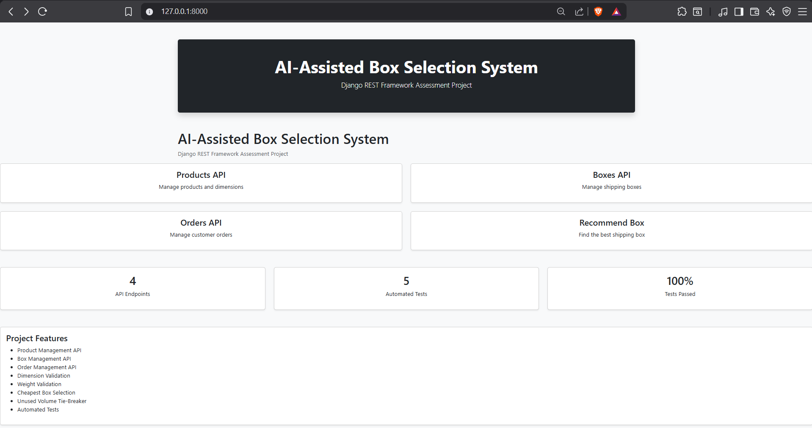
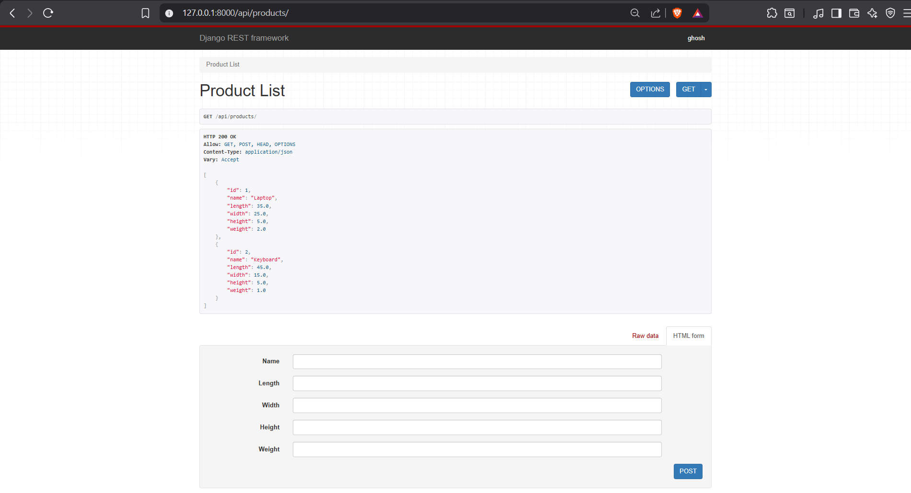
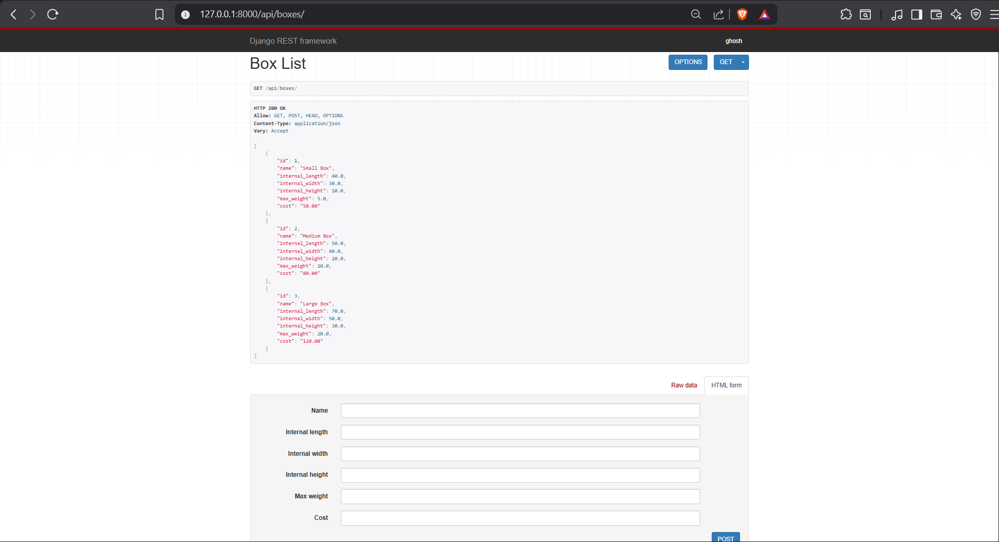
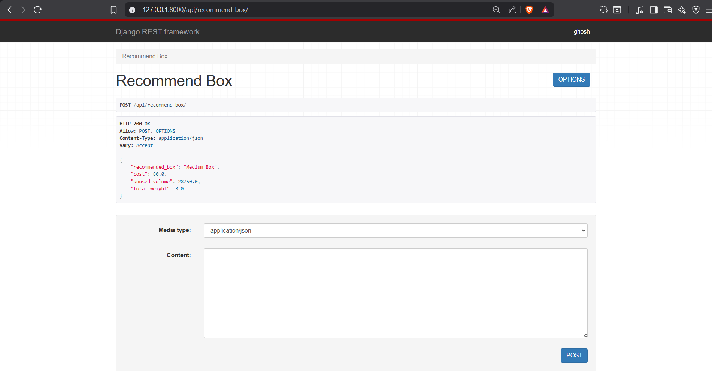
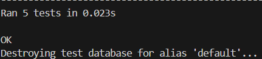

# AI-Assisted Box Selection System

## Overview

This project is a Django REST Framework application that recommends the most suitable shipping box for ecommerce orders.

The recommendation engine evaluates product dimensions and weight, then selects the cheapest valid box. If multiple boxes have the same cost, the box with the smallest unused volume is selected.

## Features

* Product Management API
* Box Management API
* Order Management API
* Shipping Box Recommendation API
* Dimension Validation
* Weight Validation
* Cheapest Box Selection
* Unused Volume Tie-Breaker
* Automated Tests
* Bootstrap Dashboard

## Tech Stack

* Python
* Django
* Django REST Framework
* SQLite
* Bootstrap 5

## Assumptions

* Products are stacked vertically for height calculation.
* Required length is the maximum product length.
* Required width is the maximum product width.
* Required height is the sum of product heights multiplied by quantity.
* Total weight is the sum of product weights multiplied by quantity.
* The cheapest valid box is selected.
* If multiple boxes have the same cost, the box with the smallest unused volume is selected.

## Box Selection Approach

The recommendation engine follows the steps below:

### 1. Calculate Required Dimensions

For all products in the order:

* Required Length = Maximum product length
* Required Width = Maximum product width
* Required Height = Sum of product heights multiplied by quantity

Example:

```text
Required Length = max(product.length)
Required Width = max(product.width)
Required Height = Σ(product.height × quantity)
```

### 2. Calculate Total Weight

The total order weight is calculated as:

```text
Total Weight = Σ(product.weight × quantity)
```

### 3. Validate Box Dimensions

A box is considered only if:

```text
box.internal_length >= required_length
box.internal_width >= required_width
box.internal_height >= required_height
```

### 4. Validate Weight Capacity

A box must also satisfy:

```text
box.max_weight >= total_weight
```

### 5. Select the Best Box

Among all valid boxes:

1. Choose the box with the lowest cost.
2. If multiple boxes have the same cost, choose the box with the smallest unused volume.

Unused volume is calculated as:

```text
unused_volume = box_volume - required_volume
```

where:

```text
box_volume = length × width × height
required_volume = required_length × required_width × required_height
```

This approach ensures that the selected box satisfies dimension and weight constraints while minimizing shipping cost and unused space.


## Installation

1. Clone the repository

```bash
git clone <repository-url>
cd tradexa-box-selector
```

2. Create a virtual environment

```bash
python -m venv venv
```

3. Activate the virtual environment

Windows:

```bash
venv\Scripts\activate
```

4. Install dependencies

```bash
pip install -r requirements.txt
```

5. Run migrations

```bash
python manage.py migrate
```

6. Start the server

```bash
python manage.py runserver
```

## API Endpoints

### Products

* GET /api/products/
* POST /api/products/

### Boxes

* GET /api/boxes/
* POST /api/boxes/

### Orders

* GET /api/orders/
* POST /api/orders/

### Recommendation

* POST /api/recommend-box/

Sample Request:

```json
{
  "items": [
    {
      "product_id": 1,
      "quantity": 1
    },
    {
      "product_id": 2,
      "quantity": 1
    }
  ]
}
```

Sample Response:

```json
{
  "recommended_box": "Medium Box",
  "cost": 80.0,
  "unused_volume": 28750.0,
  "total_weight": 3.0
}
```

## Screenshots

### Dashboard



### Products API



### Boxes API



### Recommendation Result



### Test Execution




## Running Tests

```bash
python manage.py test
```

Current Test Coverage:

* Successful recommendation
* Invalid product handling
* No suitable box found
* Cheapest box selection
* Unused volume tie-breaker
